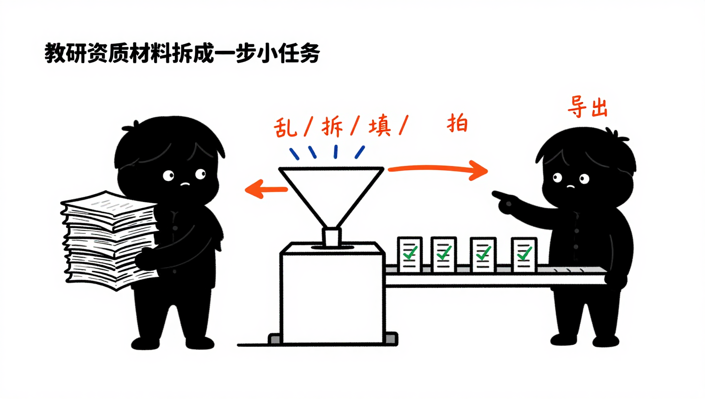
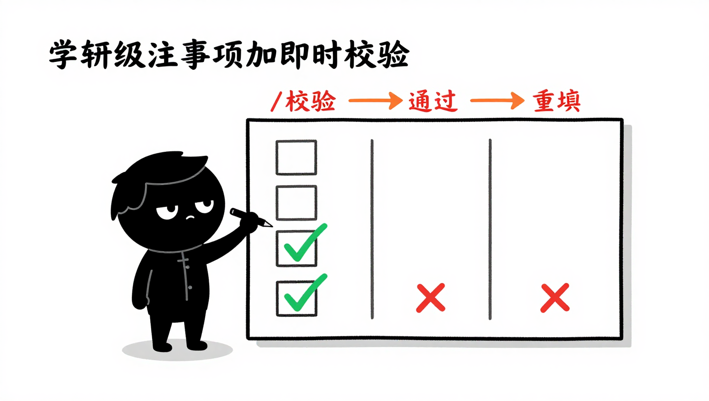
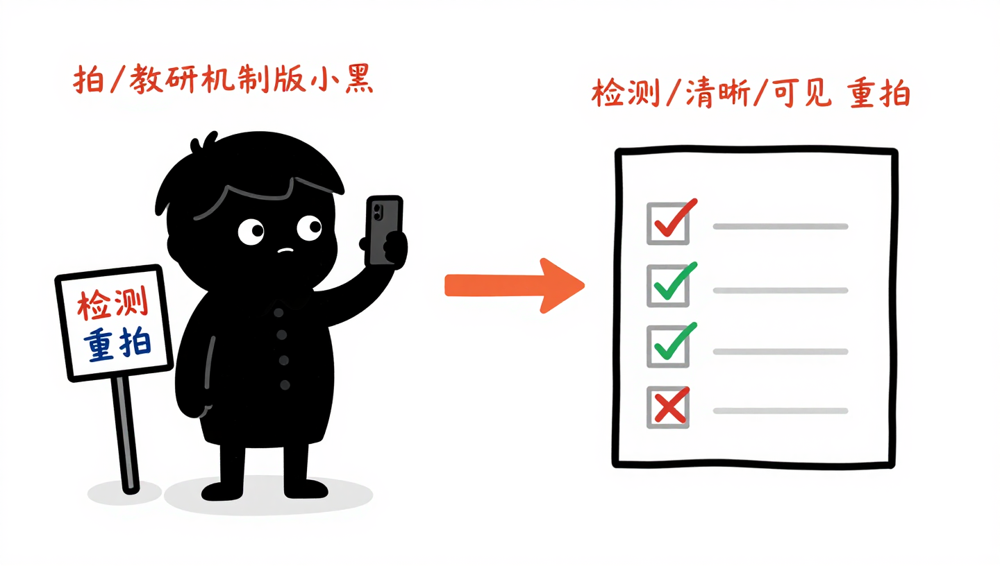
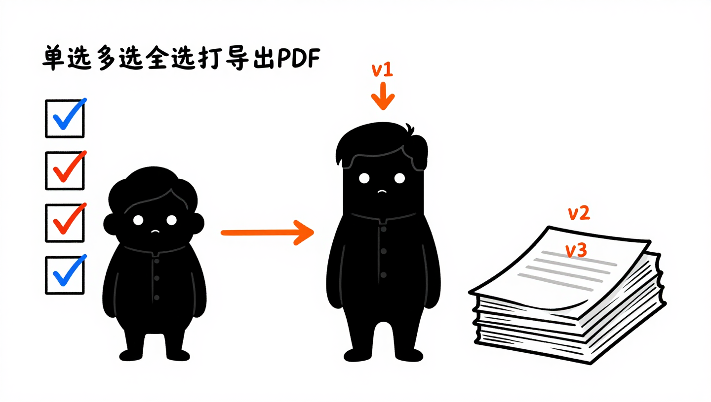

<p align="center">
  
</p>

<h1 align="center">Declaro</h1>

<p align="center" style="font-size: 1.2em; color: #57606a;">
  材料制作平台
</p>

<p align="center">
  手机端资质材料制作工具，让不会办的人也能独立完成材料准备
</p>

<p align="center">
  <a href="#核心功能">功能</a> &nbsp;·&nbsp;
  <a href="#设计原则">设计原则</a> &nbsp;·&nbsp;
  <a href="#技术架构">架构</a> &nbsp;·&nbsp;
  <a href="#快速开始">快速开始</a> &nbsp;·&nbsp;
  <a href="#项目结构">结构</a> &nbsp;·&nbsp;
  <a href="docs/">文档</a>
</p>

---

## 这是什么

办经营许可证（农药、食品、烟草等）需要填一堆表、拍一堆照、整理一堆材料。个体户和小企业主们要么花几千块找代办，要么自己对着清单硬搞，反复跑反复补。

Declaro 把复杂的材料制作流程拆成一步步可模仿的小任务，每一步告诉用户"填什么、怎么填、拍什么、怎么算合格"——填得对、拍得准、导出就完事。

> 定位：材料制作工具，不是业务审批系统。导出 PDF 后用户自行打印、盖章、提交，平台不涉及后续审批流程。

---

## 核心功能

### 步骤引导

每个材料项目为一个独立步骤，用户始终知道"当前在哪一步、下一步做什么、还剩多少步"。支持顺序推进（后台配置强制顺序）或自由跳转两种模式，切换或中断后已填内容自动保存，重新打开不丢失。

### 表单填报

<p align="center">
  
</p>

每个字段附带注意事项（说明怎么填、填什么格式），每个步骤附带参考示例（图片或文字，全屏查看后返回不丢失内容）。字段失焦即时校验，不通过时红色提示文字明确说明问题。已填内容自动本地保存，断网、切出应用、关闭重开都不丢失。

### 多材料项目独立管理

一个模板包含多个材料项目（警示牌照片、场地证明、制度文件等），每个项目支持上传多张图片/文件，项目之间独立管理互不影响。后台可配置数量约束（至少 N 张、恰好 N 张、最多 N 张），删除图片自动补位，跨项目切换时已上传内容保留。

### AI 拍照质检

<p align="center">
  
</p>

用户拍照上传后，AI 自动从清晰度、完整性、关键要素可见性等维度进行检测。支持自动触发（每张上传后立即检测）或手动批量触发。每个检测项显示"通过"或"不通过+原因"，引导用户针对问题重新拍摄。替换图片后自动重新检测全部，确保结果一致。未配置质检规则的项目直接标记完成。

### 灵活组合导出

<p align="center">
  
</p>

支持三种导出方式：单选某个项目导出、勾选多个项目合并导出、一键全选打包导出。未完成项目（表单未填完、图片未传够、质检未通过）自动拦截并提示。重复导出自动追加版本号（v1/v2/v3），大文件异步生成，任务中心可查看进度和下载。

---

## 设计原则

为 40-65 岁的个体户和小企业主设计，手机原生体验，不依赖 PC。

1. **示范化** — 每一步都有"这样就算合格"的可视化参考，用户照做就行
2. **小步快走** — 把大任务拆成小步骤，每步只关注一件事，降低心理负担
3. **即时反馈** — 拍照马上检测，填错马上提示，不让用户带着问题往下走
4. **用户可控** — 材料项目随时可增删改，导出随心组合，平台不替用户做决定
5. **手机原生** — 所有操作在手机上流畅完成，填写内容优先本地保存，离线可用

---

## 技术架构

通用引擎 + 可配置模板，新增业务不改代码，后台配置 Schema 即可。

```
┌─────────────────────────────────────────────────────────────┐
│                      手机端 (UniApp)                         │
│  步骤引导  →  动态表单 Render  →  图片上传  →  AI质检  →  PDF导出 │
└──────────────────────────────┬──────────────────────────────┘
                               │  Form Schema (JSON)
                               ▼
┌─────────────────────────────────────────────────────────────┐
│                      服务端 (Go)                             │
│  Handler  →  Service  →  Repository  分层架构                │
│  表单引擎  │  文件存储  │  AI质检对接  │  PDF生成  │  任务中心   │
└──────────────────────────────┬──────────────────────────────┘
                               │
┌──────────────────────────────▼──────────────────────────────┐
│                      后台管理端                              │
│  模板配置：项目清单、字段规则、质检标准、参考示例             │
└─────────────────────────────────────────────────────────────┘
```

- **业务模板**：农药经营许可（首个）、食品经营许可、烟草专卖零售许可等
- **平台通用能力**：步骤引导、表单渲染、文件管理、AI 质检、PDF 生成，一套代码适配所有业务
- **Form Schema + Render**：后台配置输出 JSON，前端动态渲染表单，新增业务模板前端零改动

---

## 项目结构

```
Declaro/
├── server/        Go 服务端（Handler → Service → Repository 分层架构）
├── web/           React Web 前端（后台管理端）
├── uniapp/        UniApp 移动端（业主使用端）
├── shared/        跨端共享类型定义（从 openapi.yaml 自动生成）
├── docs/          项目文档
│   ├── prd/         产品需求文档
│   ├── design/      技术设计文档
│   ├── qa/          质量保证文档
│   └── api/         OpenAPI 接口规范
├── assets/        设计素材与配图
└── deploy/        部署配置与资产
```

---

## 快速开始

```bash
# 目录结构校验
make check-structure
```

API 规范位于 `docs/api/openapi.yaml`，将其导入 API Fox、Swagger 或 Postman 即可查看完整接口文档并生成 Mock 服务。

> 项目状态：MVP 开发中，首个模板「农药经营许可」正在建设。

---

## 文档

| 文档 | 说明 |
|------|------|
| [产品需求文档](docs/prd/材料制作平台PRD.md) | v1.1，包含完整 GWT 场景描述与验收标准 |
| [OpenAPI 接口规范](docs/api/openapi.yaml) | OpenAPI 3.0 规范，7 组 22 个接口，可直接生成 Mock |
| [文档中心](docs/) | 文档目录结构与索引 |

---

## 本期不做

- 用户注册/登录体系（MVP 阶段后置，随手随用）
- 审批流程、盖章功能
- 材料直接提交到政府端的能力
- PC 端适配（手机端优先）
- 具体业务逻辑处理（业务逻辑属于模板配置范畴）

---

<p align="center">
  <sub>专为小微经营者设计</sub>
</p>
