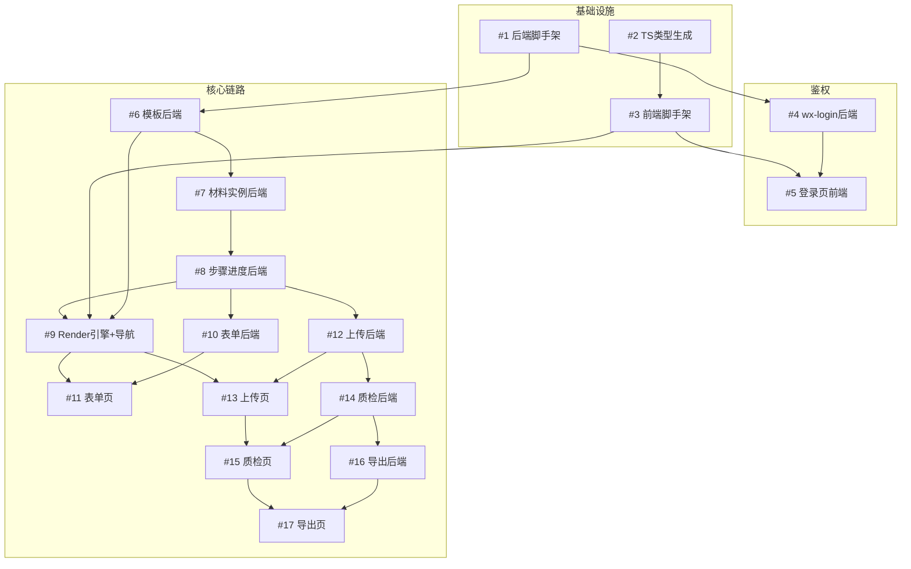

# 材料制作平台 v1.0.0 任务拆解

> **来源：** PRD v1.1 + openapi.yaml v1.0.0
> **版本范围：** Must Have（表单填报 + AI 质检）+ Should Have（步骤引导 + 多项目上传 + 组合导出）+ 鉴权/模板/实例前置依赖
> **后置范围：** 后台管理端（web/）→ v1.1.0
> **团队假设：** 3-5 人中型团队，前后端并行，单 Issue 1-1.5 天
> **Issue 总数：** 17 个（基础设施 3 + 后端 7 + 前端 7）
> **拆解日期：** 2026-07-08

---

## 1. 拆解原则

1. **每个 Issue 是 PRD GWT 场景在 openapi.yaml 上的工程化投影**：GWT 的 Then → 翻译成 Issue 的验收标准（具体接口行为）
2. **前后端解耦**：后端 Issue 以 openapi operationId 为契约，前端 Issue 以 openapi schema 为契约，两者可并行
3. **依赖不成环**：A 等 B、B 等 A 视为拆分失败，必须重拆
4. **单 Issue ≤ 2 天**：超过则继续拆
5. **参照可追溯**：每个 Issue 标注 PRD 章节号 + openapi operationId

---

## 2. Issue 汇总表

| Issue | 标题 | 类型 | 模块 | 依赖 | 预估 |
|-------|------|------|------|------|------|
| #1 | 后端脚手架：错误码体系 + 统一响应 + JWT 中间件 + DB 连接 | BE | infra | — | 1.5d |
| #2 | shared/api-types 自动生成（openapi.yaml → TS 类型） | Infra | shared | — | 1d |
| #3 | uniapp 前端脚手架：请求封装 + token 管理 + 路由 + 状态管理 | FE | infra | #2 | 1.5d |
| #4 | 鉴权模块后端：wx-login（code→OpenID→session_token） | BE | auth | #1 | 1d |
| #5 | 登录页前端：wx.login → 换 token → 跳首页 | FE | auth | #3,#4 | 1d |
| #6 | 模板管理后端：listTemplates / getTemplate / getTemplateSchema | BE | template | #1 | 1d |
| #7 | 材料实例后端：createMaterial（锁 schema_version）/ getMaterial + OpenID 隔离 | BE | material | #1,#6 | 1d |
| #8 | 步骤进度后端：getStepProgress / gotoStep（顺序/自由跳转） | BE | step | #7 | 1d |
| #9 | Form Schema Render 引擎 + 模板列表页 + 步骤导航框架 | FE | template/step | #3,#6,#8 | 2d |
| #10 | 表单填报后端：getFormData / saveFormData / validateField | BE | form | #8 | 1d |
| #11 | 表单填报页：实时校验 + 参考示例全屏 + 本地缓存 + 回退加载 | FE | form | #9,#10 | 2d |
| #12 | 文件上传后端：listFiles / uploadFile / replaceFile / deleteFile + 数量约束 + 补位 | BE | file | #8 | 1.5d |
| #13 | 文件上传页：拍照/相册 + 预览/删除/替换 + 数量展示 + 跨项目切换 | FE | file | #9,#12 | 1.5d |
| #14 | AI 质检后端：triggerQualityCheck / getResult + 32 并发限流 + 替换重检 + 无规则跳过 | BE | quality | #12 | 2d |
| #15 | AI 质检结果页：按检测项聚合展示 + 通过/不通过 + 重拍引导 | FE | quality | #13,#14 | 1d |
| #16 | 导出管理后端：createExportTask + 未完成拦截 + 异步生成 + 版本号 + 任务中心 | BE | export | #14 | 2d |
| #17 | 导出页 + 任务中心：单选/多选/全选 + 拦截提示 + 进度追踪 + 下载 | FE | export | #15,#16 | 1.5d |

---

## 3. 依赖关系图

---

## 4. 里程碑

| 节点 | 条件 | 版本 |
|------|------|------|
| 基础设施就绪 | #1 #2 #3 合并 | v1.0.0 |
| 鉴权闭环 | #4 #5 合并（用户能登录） | v1.0.0 |
| 核心链路打通 | #6→#7→#8→#9 合并（能选模板、看步骤） | v1.0.0 |
| Must Have 完成 | #10 #11 #12 #13 #14 #15 合并（表单+上传+质检闭环） | v1.0.0 |
| Should Have 完成 | #16 #17 合并（导出闭环） | v1.0.0 |
| 提测 | CI 绿 + 自测齐全 | v1.0.0 |
| 上线 | PRD GWT 全通过 + 打 Tag v1.0.0 | v1.0.0 |

---

## 5. Issue 完整内容

> 每个 Issue 的 body 部分可直接复制到 GitCode 创建。标题已在 Issue 标题行给出。

<!-- ISSUE:1:START -->
### Issue #1：后端脚手架：错误码体系 + 统一响应 + JWT 中间件 + DB 连接

**目标版本：** v1.0.0
**负责人：** @待指派
**预估：** 1.5d
**依赖：** 无

**参照来源：**
- openapi.yaml：`ErrorResponse` schema（错误码段位定义）、`BearerAuth` securityScheme
- project_memory：错误码体系（0 成功；1xxxx 鉴权、2xxxx 步骤、3xxxx 文件、4xxxx 质检、5xxxx 导出、9xxxx 系统级）
- project_memory：Handler → Service → Repository 分层架构

**输出：**
- `server/pkg/errcode/`：错误码常量与段位定义
- `server/pkg/response/`：统一响应封装（code/msg/data 三段式）
- `server/internal/middleware/`：JWT 鉴权中间件（解析 session_token → OpenID 注入 context）
- `server/internal/config/`：DB 连接、JWT secret、微信 appid/secret 配置加载
- `server/internal/router/`：路由注册骨架 + 健康检查接口

**验收标准：**

| # | 验收项 | 标准 |
|---|--------|------|
| 1 | 统一响应格式 | 所有接口返回 `{code, msg, data}`，code=0 表成功 |
| 2 | 错误码段位 | errcode 包定义 1xxxx/2xxxx/3xxxx/4xxxx/5xxxx/9xxxx 段位常量，可按段位查询 |
| 3 | JWT 中间件 | 未带 token 返回 401 + code 10001；token 过期返回 401 + code 10002；有效 token 解析出 OpenID 注入 request context |
| 4 | 分层骨架 | router → handler → service → repository 目录结构就绪，无跨层调用 |
| 5 | DB 连接 | 配置加载成功，能 ping 通数据库，支持迁移目录 `server/migrations/` |

**技术要点：**
- JWT payload 至少含 `openid`、`exp`；签名密钥从 config 读取
- 统一响应中间件包裹所有 handler，handler 只返回 (data, err)
- 错误码与 HTTP 状态分离：业务码走 body.code，HTTP 码仅表传输层
- 鉴权接口（wx-login）通过路由级 `security: []` 豁免中间件

**关联 Issue：** 阻塞 #4 #6（所有需鉴权的后端模块）
<!-- ISSUE:1:END -->

<!-- ISSUE:2:START -->
### Issue #2：shared/api-types 自动生成（openapi.yaml → TS 类型）

**目标版本：** v1.0.0
**负责人：** @待指派
**预估：** 1d
**依赖：** 无

**参照来源：**
- project_memory：API types in shared/api-types/ must be generated from docs/api/openapi.yaml; handwritten types are forbidden
- openapi.yaml：所有 schemas（Template / FormSchema / MaterialInstance / StepProgress / FormData / UploadedFile / QualityCheckResult / ExportTask 等）

**输出：**
- `shared/api-types/`：从 openapi.yaml 自动生成的 TS 类型文件
- 生成脚本（如 openapi-typescript 或类似工具）配置到 package.json
- `shared/README.md`：类型生成与更新流程说明

**验收标准：**

| # | 验收项 | 标准 |
|---|--------|------|
| 1 | 类型完整 | openapi.yaml 中所有 schemas 都有对应 TS 类型，无手写补充 |
| 2 | 可重生成 | 修改 openapi.yaml 后执行脚本即可重新生成，类型与 yaml 一致 |
| 3 | 双端可用 | uniapp 和 web 都能从 `shared/api-types/` 导入类型 |
| 4 | required 字段 | schema 中 required 字段在 TS 类型中为必填，非 required 为可选 |

**技术要点：**
- 严禁手写类型覆盖生成结果
- 生成脚本纳入 `make` 命令，openapi.yaml 变更后 CI 校验类型是否同步
- operationId 应映射为请求/响应类型命名

**关联 Issue：** 阻塞 #3（前端脚手架依赖类型）
<!-- ISSUE:2:END -->

<!-- ISSUE:3:START -->
### Issue #3：uniapp 前端脚手架：请求封装 + token 管理 + 路由 + 状态管理

**目标版本：** v1.0.0
**负责人：** @待指派
**预估：** 1.5d
**依赖：** #2

**参照来源：**
- openapi.yaml：`BearerAuth`（请求头携带 Authorization）、`IdempotencyKey`（幂等键）、`TooManyRequests`（限流响应）
- project_memory：表单数据本地保存（防丢失）、网络异常自动重试

**输出：**
- `uniapp/packages/app/src/api/request.ts`：统一请求封装（拦截器、token 注入、错误码处理）
- `uniapp/packages/app/src/store/`：token 存储、用户状态
- `uniapp/packages/app/src/pages.json`：路由配置骨架
- 本地缓存工具：表单数据持久化（uni.setStorage）

**验收标准：**

| # | 验收项 | 标准 |
|---|--------|------|
| 1 | token 注入 | 请求拦截器自动在 header 加 `Authorization: Bearer <token>`；token 过期（401）触发重新登录 |
| 2 | 错误码处理 | 统一拦截 code≠0 的响应，按段位路由错误提示（1xxxx 鉴权、3xxxx 文件等） |
| 3 | 幂等键 | POST 请求自动生成 `Idempotency-Key`（UUID v4） |
| 4 | 限流处理 | 收到 429 读取 `Retry-After` header，提示用户等待 |
| 5 | 本地缓存 | 提供 `saveFormLocal(material_id, step_id, fields)` / `getFormLocal()` 工具，断网可读 |
| 6 | 路由骨架 | pages.json 配置首页/模板列表/材料填写/导出等基础路由 |
| 7 | 单元测试 | `pnpm --filter @declaro/uniapp-app test` 全部通过；覆盖 api/errcode、api/request、utils/uuid、utils/storage、utils/form-cache、config、store/modules/user、pages.json 全部模块 |
| 8 | 覆盖率门槛 | `pnpm --filter @declaro/uniapp-app test:coverage` 行覆盖 ≥80%、函数覆盖 ≥80%、分支覆盖 ≥75%（vitest.config.ts thresholds 强制；当前实际：100% 行 / 100% 函数 / 94% 分支） |

**技术要点：**
- 请求封装基于 uni.request，统一 try/catch
- token 存储用 uni.setStorageSync，应用启动时校验有效期
- 本地缓存 key 设计：`form:{material_id}:{step_id}`，避免冲突

**关联 Issue：** 阻塞 #5 #9（所有前端页面的基础设施）
<!-- ISSUE:3:END -->

<!-- ISSUE:4:START -->
### Issue #4：鉴权模块后端：wx-login（code→OpenID→session_token）

**目标版本：** v1.0.0
**负责人：** @待指派
**预估：** 1d
**依赖：** #1

**参照来源：**
- PRD §6：采用微信小程序 OpenID 作为隐式用户标识（wx.login() 自动获取），用于数据隔离
- openapi.yaml：`wxLogin` operationId、`/api/v1/auth/wx-login` 路径
- project_memory：OpenID 通过 code 换取后签发 session_token，业务接口通过 Authorization: Bearer 携带

**输出：**
- `POST /api/v1/auth/wx-login`
- 微信 code2session 调用封装
- session_token 签发（JWT 含 openid）

**验收标准：**

| # | GWT 场景 | 验收标准 |
|---|----------|----------|
| 1 | 正常登录 | code 有效 → 200 + `{session_token, expires_in}`；openid 仅开发环境返回 |
| 2 | code 无效/过期 | code 失效 → 401 + code 10001 + msg "code 无效或已过期" |
| 3 | 微信服务异常 | code2session 调用失败 → 500 + code 90001 |

**技术要点：**
- 调用微信 `jscode2session` 接口换取 openid + session_key
- session_key 暂存（供后续可能的水印/解密用），openid 落库（首次登录自动建档）
- token 有效期 7200 秒，过期前端走重新登录流程
- 该接口路由级豁免 JWT 中间件（`security: []`）

**关联 Issue：** 阻塞 #5（登录页前端依赖接口）
<!-- ISSUE:4:END -->

<!-- ISSUE:5:START -->
### Issue #5：登录页前端：wx.login → 换 token → 跳首页

**目标版本：** v1.0.0
**负责人：** @待指派
**预估：** 1d
**依赖：** #3, #4

**参照来源：**
- PRD §6：用户无需手动注册/登录，wx.login() 自动获取
- openapi.yaml：`wxLogin` 接口契约

**输出：**
- `uniapp/packages/app/src/pages/login/index.vue`：登录页
- 启动时静默登录逻辑（App.vue onLoad）

**验收标准：**

| # | GWT 场景 | 验收标准 |
|---|----------|----------|
| 1 | 首次打开 | 应用启动自动调 wx.login() 拿 code → 调后端换 token → 存本地 → 跳首页 |
| 2 | token 有效 | 二次打开直接跳首页，不重复请求登录 |
| 3 | token 过期 | 业务接口 401 → 触发静默重登 → 重试原请求（用户无感） |
| 4 | 网络异常 | 登录失败弹提示"网络异常，请重试"，提供重试按钮 |

**技术要点：**
- 静默登录，用户无感知，无登录按钮
- token 过期重登后需重放失败的请求（请求队列机制）
- PRD §6 明确"无登录态"指用户无需手动登录，不代表无 token

**关联 Issue：** 无（登录闭环完成）
<!-- ISSUE:5:END -->

<!-- ISSUE:6:START -->
### Issue #6：模板管理后端：listTemplates / getTemplate / getTemplateSchema

**目标版本：** v1.0.0
**负责人：** @待指派
**预估：** 1d
**依赖：** #1

**参照来源：**
- PRD §3：平台是通用引擎，业务是可配置模板；Form Schema + Render 引擎
- openapi.yaml：`listTemplates`、`getTemplate`、`getTemplateSchema` operationId
- openapi.yaml schemas：`Template`、`FormSchema`、`StepSchema`、`FieldSchema`、`UploadConfig`

**输出：**
- `GET /api/v1/templates`：启用模板列表
- `GET /api/v1/templates/{template_id}`：模板详情
- `GET /api/v1/templates/{template_id}/schema`：Form Schema（含步骤、字段、上传配置、质检规则）

**验收标准：**

| # | 验收项 | 标准 |
|---|--------|------|
| 1 | 列表 | 只返回 status=enabled 的模板 |
| 2 | 详情 | 404 当 template_id 不存在 |
| 3 | Schema 完整 | 返回 FormSchema 含 steps[]，每个 step 含 fields[] 或 upload_config |
| 4 | 数据隔离 | 模板为全局共享，无 OpenID 隔离（实例才隔离） |
| 5 | 版本字段 | FormSchema.version 字段返回 schema_version |

**技术要点：**
- 首期模板数据可用种子数据（农药经营许可）配置入库，后台管理端后置 v1.1.0
- Form Schema 是前端 Render 引擎的唯一数据源，结构必须与 openapi.yaml schema 对齐
- `UploadConfig.quality_check_rules` 为空数组表示该步骤无质检规则

**关联 Issue：** 阻塞 #7 #9
<!-- ISSUE:6:END -->

<!-- ISSUE:7:START -->
### Issue #7：材料实例后端：createMaterial / getMaterial + OpenID 数据隔离

**目标版本：** v1.0.0
**负责人：** @待指派
**预估：** 1d
**依赖：** #1, #6

**参照来源：**
- PRD §3：一个模板可被多个业主同时使用，互不干扰；模板版本管理，修改不影响存量
- openapi.yaml：`createMaterial`、`getMaterial` operationId；`MaterialInstance` schema
- project_memory：基于 OpenID 的 DataScope，跨用户访问返回 403

**输出：**
- `POST /api/v1/materials`：创建实例（带 Idempotency-Key 幂等）
- `GET /api/v1/materials/{material_id}`：获取实例详情
- OpenID 数据隔离中间件/拦截逻辑

**验收标准：**

| # | GWT 场景 | 验收标准 |
|---|----------|----------|
| 1 | 正常创建 | 传 template_id → 200 + MaterialInstance，schema_version 锁定为当前模板版本 |
| 2 | 模板不存在 | template_id 无效 → 404 |
| 3 | 幂等 | 相同 Idempotency-Key 重复请求 → 返回首次结果，不重复创建 |
| 4 | 数据隔离 | A 用户访问 B 用户的 material → 403 + code 10003 |
| 5 | schema 锁定 | 模板后续修改 schema_version，已创建实例仍用旧版本 |

**技术要点：**
- 实例创建时从 template 读取当前 schema_version 并固化到实例表（后续模板改版不影响）
- material_id 生成建议带日期前缀（如 mat_20260708_xxx）
- OpenID 从 JWT context 获取，所有查询自动加 `WHERE openid = ?` 谓词
- 幂等键 24 小时窗口

**关联 Issue：** 阻塞 #8
<!-- ISSUE:7:END -->

<!-- ISSUE:8:START -->
### Issue #8：步骤进度后端：getStepProgress / gotoStep（顺序/自由跳转）

**目标版本：** v1.0.0
**负责人：** @待指派
**预估：** 1d
**依赖：** #7

**参照来源：**
- PRD §5.1 步骤引导：正常路径、异常A跳转控制（顺序推进/自由跳转）、异常B中断恢复
- openapi.yaml：`getStepProgress`、`gotoStep` operationId；`StepProgress`、`StepDetail` schema；`Template.navigation_mode`
- project_memory：步骤跳转控制由后端模板配置决定（顺序推进/自由跳转）

**输出：**
- `GET /api/v1/materials/{material_id}/progress`：进度信息
- `POST /api/v1/materials/{material_id}/steps/{step_id}/goto`：跳转步骤
- 步骤状态计算逻辑（completed/current/pending/locked）

**验收标准：**

| # | GWT 场景 | 验收标准 |
|---|----------|----------|
| 1 | 正常路径 | 返回 current_step_id、total_steps、completed_steps、各步骤 status |
| 2 | 顺序推进+前置未完成 | navigation_mode=sequential，前置步骤未完成跳转 → 403 + code 20001 + msg "请先完成当前步骤" |
| 3 | 自由跳转 | navigation_mode=free，允许跳到任意步骤，已填内容保留 |
| 4 | 中断恢复 | 重新打开返回上次 current_step_id，进度不丢失 |
| 5 | 状态展示 | 顺序模式下未完成步骤 status=locked，自由模式下=pending |

**技术要点：**
- 步骤完成状态依赖：form 类型→字段是否填完；upload 类型→图片数量是否达标；质检是否通过
- navigation_mode 从实例关联的模板读取（实例锁定的 schema_version 对应的模板配置）
- current_step_id 持久化，支持中断恢复

**关联 Issue：** 阻塞 #9 #10 #12
<!-- ISSUE:8:END -->

<!-- ISSUE:9:START -->
### Issue #9：Form Schema Render 引擎 + 模板列表页 + 步骤导航框架

**目标版本：** v1.0.0
**负责人：** @待指派
**预估：** 2d
**依赖：** #3, #6, #8

**参照来源：**
- PRD §3：Form Schema + Render 引擎；同一套 Render 适配所有业务模板
- openapi.yaml：`listTemplates`、`getTemplateSchema`、`getStepProgress`、`gotoStep`；`FormSchema`/`StepSchema`/`FieldSchema` schema
- PRD §5.1：用户能看到"当前在第几步、已完成几步、剩余几步"

**输出：**
- `uniapp/packages/app/src/pages/templates/index.vue`：模板列表页
- `uniapp/packages/app/src/components/FormRenderer/`：动态表单渲染引擎
- `uniapp/packages/app/src/components/StepNav/`：步骤导航组件（进度条/步骤列表）
- 字段类型组件：text/textarea/phone/id_card/date/select/radio/checkbox/cascader/image/signature

**验收标准：**

| # | GWT 场景 | 验收标准 |
|---|----------|----------|
| 1 | 模板列表 | 调 listTemplates 展示启用模板卡片，点击进入创建实例 |
| 2 | Schema 驱动渲染 | FormRenderer 读取 Form Schema 动态渲染字段，不硬编码任何业务字段 |
| 3 | 字段类型覆盖 | 支持 FieldSchema.type 全部 13 种枚举渲染 |
| 4 | 进度展示 | StepNav 显示"已完成 X / 共 Y 步"，当前步骤高亮 |
| 5 | 顺序模式 | navigation_mode=sequential 时未完成步骤置灰不可点 |
| 6 | 自由模式 | navigation_mode=free 时所有步骤可点 |
| 7 | 中断恢复 | 重新打开回到 current_step_id，调用 gotoStep 不触发跳转校验 |

**技术要点：**
- FormRenderer 是平台核心，必须完全 Schema 驱动，零业务硬编码
- 字段组件统一接口：props 接收 fieldSchema + value，emit change
- 新增一个业务模板 = 不改 FormRenderer 代码，只配 Schema
- 步骤类型 form/upload/both 决定渲染表单还是上传区

**关联 Issue：** 阻塞 #11 #13
<!-- ISSUE:9:END -->

<!-- ISSUE:10:START -->
### Issue #10：表单填报后端：getFormData / saveFormData / validateField

**目标版本：** v1.0.0
**负责人：** @待指派
**预估：** 1d
**依赖：** #8

**参照来源：**
- PRD §5.2 表单填报：正常路径、异常A格式校验、异常C回退修改
- openapi.yaml：`getFormData`、`saveFormData`、`validateField` operationId；`FormData` schema；`FieldSchema.validation`（pattern/min_length/max_length）

**输出：**
- `GET /api/v1/materials/{material_id}/steps/{step_id}/form`：获取已填数据
- `PUT /api/v1/materials/{material_id}/steps/{step_id}/form`：保存字段（auto_save 标识）
- `POST /api/v1/materials/{material_id}/steps/{step_id}/validate`：单字段校验

**验收标准：**

| # | GWT 场景 | 验收标准 |
|---|----------|----------|
| 1 | 正常保存 | PUT fields → 200 + saved_at 时间戳 |
| 2 | 回退加载 | GET 返回已填字段，未填字段为空字符串 |
| 3 | 格式校验通过 | validate 传符合 pattern 的值 → 200 + valid=true |
| 4 | 格式校验失败 | validate 传不符合 pattern 的值 → 200 + valid=false + error_message |
| 5 | 必填校验 | required 字段空值失焦 → valid=false + "此项必填" |
| 6 | 跨步骤隔离 | 修改步骤2不影响步骤3的已填数据 |
| 7 | 数据隔离 | 跨用户访问 → 403 |

**技术要点：**
- 校验规则从 Form Schema 的 FieldSchema.validation 读取（pattern/min_length/max_length）
- 保存为字段级 key-value，auto_save=true 时前端失焦逐字段 PUT
- 校验接口同步返回结果，不异步

**关联 Issue：** 阻塞 #11
<!-- ISSUE:10:END -->

<!-- ISSUE:11:START -->
### Issue #11：表单填报页：实时校验 + 参考示例全屏 + 本地缓存 + 回退加载

**目标版本：** v1.0.0
**负责人：** @待指派
**预估：** 2d
**依赖：** #9, #10

**参照来源：**
- PRD §5.2：异常A格式校验即时反馈（失焦红色提示）、异常B查看参考示例（全屏+数据保留）、异常C回退修改（自动加载+不影响他步）
- PRD §5.1 异常B：中断恢复，本地保存
- openapi.yaml：`getFormData`、`saveFormData`、`validateField`；`StepSchema.example_image_url`、`FieldSchema.tips`

**输出：**
- 表单填报页（基于 FormRenderer 扩展）
- 失焦校验逻辑 + 红色错误提示组件
- 参考示例全屏查看组件
- 本地缓存读写（接 #3 的工具方法）

**验收标准：**

| # | GWT 场景 | 验收标准 |
|---|----------|----------|
| 1 | 正常填报 | 字段旁显示 label + tips 注意事项，填写后失焦自动 PUT 保存 |
| 2 | 格式即时反馈 | 失焦时调 validate，不通过 → 字段下方红色 error_message，修正后消失 |
| 3 | 必填校验 | required 字段空值失焦 → 红色"此项必填" |
| 4 | 参考示例 | 点击"查看示例" → 全屏展开 example_image_url，关闭后已填内容不变 |
| 5 | 回退加载 | 回到已完成步骤 → 自动 GET 加载已填内容 |
| 6 | 跨步骤隔离 | 修改步骤2不影响步骤3数据 |
| 7 | 中断恢复 | 切出应用/断网/关机重启 → 重开后已填内容仍在（本地缓存兜底） |
| 8 | 本地优先 | 断网时写本地缓存，联网后逐字段 PUT 同步 |

**技术要点：**
- 失焦触发 validate + save 两个请求（或合并校验逻辑在前端先跑 pattern，再调后端确认）
- 本地缓存 key：`form:{material_id}:{step_id}`，含 timestamp，联网后按 timestamp 增量同步
- 参考示例全屏用 uni.previewImage 或自绘全屏组件
- 红色提示组件与 FormRenderer 字段组件解耦，通过 slot 注入

**关联 Issue：** 无（表单闭环）
<!-- ISSUE:11:END -->

<!-- ISSUE:12:START -->
### Issue #12：文件上传后端：listFiles / uploadFile / replaceFile / deleteFile + 数量约束 + 补位

**目标版本：** v1.0.0
**负责人：** @待指派
**预估：** 1.5d
**依赖：** #8

**参照来源：**
- PRD §5.3 多材料项目上传：正常路径、异常A数量约束（≥N/=N/≤N）、异常B删除补位、异常C跨项目切换
- openapi.yaml：`listFiles`、`uploadFile`、`replaceFile`、`deleteFile` operationId；`UploadedFile` schema；`UploadConfig`（min_count/max_count）

**输出：**
- `GET /api/v1/materials/{material_id}/steps/{step_id}/files`：文件列表 + 数量约束
- `POST /api/v1/materials/{material_id}/steps/{step_id}/files`：上传（multipart）
- `PUT /api/v1/materials/{material_id}/steps/{step_id}/files/{file_id}`：替换（触发重检）
- `DELETE /api/v1/materials/{material_id}/steps/{step_id}/files/{file_id}`：删除

**验收标准：**

| # | GWT 场景 | 验收标准 |
|---|----------|----------|
| 1 | 正常上传 | POST file → 200 + UploadedFile（含 url/thumbnail_url） |
| 2 | 数量约束-超限 | 已达 max_count → 409 + code 30001 + msg "最多上传X张" + 返回 max_count/current_count |
| 3 | 数量约束-不足 | count < min_count → 步骤状态标记未完成（不影响上传本身） |
| 4 | 删除补位 | 删除第2张 → 第3张自动补位，列表重排，remaining_count 更新 |
| 5 | 替换重检 | PUT 替换 → 200 + msg "替换成功，已触发重新质检"（质检规则非空时） |
| 6 | 跨项目切换 | 切到项目B再回A → listFiles 返回A的已传文件 |
| 7 | 数据隔离 | 跨用户 → 403 |
| 8 | 幂等 | upload 带 Idempotency-Key，重复请求返回首次结果 |

**技术要点：**
- 数量约束规则从 UploadConfig 读取（min_count/max_count，0 表示不限制）
- 删除后 reorder：文件维护 index 字段，删除后重建索引
- replaceFile 是原子操作（避免 DELETE+POST 中间态导致质检不一致）
- 文件存储：对象存储（OSS/COS）或本地磁盘，返回可访问 url + thumbnail_url

**关联 Issue：** 阻塞 #13 #14
<!-- ISSUE:12:END -->

<!-- ISSUE:13:START -->
### Issue #13：文件上传页：拍照/相册 + 预览/删除/替换 + 数量展示 + 跨项目切换

**目标版本：** v1.0.0
**负责人：** @待指派
**预估：** 1.5d
**依赖：** #9, #12

**参照来源：**
- PRD §5.3：正常路径（拍照/相册上传，预览/删除/替换）、异常A数量约束（提示还需/最多）、异常B删除补位（自动重排）、异常C跨项目切换（独立管理）
- openapi.yaml：`listFiles`、`uploadFile`、`replaceFile`、`deleteFile`

**输出：**
- 文件上传页（步骤 type=upload/both 时渲染）
- 拍照/相册选择组件（uni.chooseImage）
- 图片网格预览 + 长按删除/替换
- 数量进度展示（已传/要求）

**验收标准：**

| # | GWT 场景 | 验收标准 |
|---|----------|----------|
| 1 | 拍照上传 | 调相机拍照 → 上传 → 网格新增一张 + 数量+1 |
| 2 | 相册上传 | 相册选择 → 上传 → 网格更新 |
| 3 | 预览 | 点击图片全屏预览 |
| 4 | 删除补位 | 删除中间一张 → 后续自动前移补位 + 数量-1 + 提示更新 |
| 5 | 数量约束-不足 | count < min_count → 显示"还需上传 X 张" + 步骤标未完成 |
| 6 | 数量约束-超限 | count = max_count → 禁用上传按钮 + 提示"最多上传X张" |
| 7 | 替换 | 长按图片 → 替换 → 重新拍照/选图 → 触发重检提示 |
| 8 | 跨项目切换 | 切到项目B操作 → 回A时已传图片仍在 |
| 9 | 网络异常 | 上传失败 → 本地暂存 + 自动重试 + 失败弹窗"重试"按钮 |

**技术要点：**
- 拍照用 uni.chooseImage({sourceType:['camera']})，相册用 ['album']
- 上传进度展示（uni.uploadFile onProgressUpdate）
- 网络异常时图片暂存本地，联网后自动重试（接 #3 缓存机制）
- 图片网格用 scroll-view 横向滑动或纵向 grid

**关联 Issue：** 阻塞 #15
<!-- ISSUE:13:END -->

<!-- ISSUE:14:START -->
### Issue #14：AI 质检后端：triggerQualityCheck / getResult + 32 并发限流 + 替换重检 + 无规则跳过

**目标版本：** v1.0.0
**负责人：** @待指派
**预估：** 2d
**依赖：** #12

**参照来源：**
- PRD §5.4 AI 拍照质检：正常路径（按检测项返回通过/不通过+原因）、异常A网络超时（重试+手动重试）、异常B替换重检（全量重检）、异常C未配置规则（跳过+绿勾）
- PRD §6：AI 质检并发最多 32，单次平均 30 秒
- openapi.yaml：`triggerQualityCheck`、`getQualityCheckResult` operationId；`QualityCheckResult` schema；`UploadConfig.quality_check_rules`、`auto_check`

**输出：**
- `POST /api/v1/materials/{material_id}/steps/{step_id}/quality-check`：触发质检（auto/manual）
- `GET /api/v1/materials/{material_id}/steps/{step_id}/quality-check`：获取结果
- 并发限流中间件（32 并发）
- AI 服务调用封装（对接外部质检模型）

**验收标准：**

| # | GWT 场景 | 验收标准 |
|---|----------|----------|
| 1 | 正常质检 | 触发 → 200 + QualityCheckResult（含 items[]：rule_id/rule_name/passed/reason） |
| 2 | 结果聚合 | 按 rule_id 聚合，不是按图片逐张返回 |
| 3 | 并发限流 | 超过 32 并发 → 429 + code 40002 + Retry-After header + msg "质检服务繁忙" |
| 4 | 超时 | AI 服务超时 → 504 + code 40001 + msg "检测失败，请检查网络后重试" |
| 5 | 替换重检 | 文件替换后（auto_check=true）自动全量重检，旧结果清空 |
| 6 | 未配置规则 | quality_check_rules 为空 → GET 返回 status=skipped，前端显示绿勾 |
| 7 | 触发方式 | trigger_type=auto 单张上传后触发；=manual 用户批量触发 |
| 8 | 自动重试 | 网络异常自动重试若干次，仍失败再返回错误 |

**技术要点：**
- 质检结果按 rule 聚合：同一 rule 下所有图片的综合判定（任一不过→该 rule failed）
- 并发控制用 semaphore/令牌桶，32 是全局上限
- AI 模型调用可能是异步的：trigger 返回 pending/checking，前端轮询 GET 直到 passed/failed
- 无规则跳过逻辑：UploadConfig.quality_check_rules.length === 0 → status=skipped
- 替换重检：replaceFile 后检查该步骤 auto_check，true 则异步触发 triggerQualityCheck

**关联 Issue：** 阻塞 #15 #16
<!-- ISSUE:14:END -->

<!-- ISSUE:15:START -->
### Issue #15：AI 质检结果页：按检测项聚合展示 + 通过/不通过 + 重拍引导

**目标版本：** v1.0.0
**负责人：** @待指派
**预估：** 1d
**依赖：** #13, #14

**参照来源：**
- PRD §5.4 正常路径：每个检测项显示一条结果——绿色"通过"或红色"不通过+原因"，引导重拍
- PRD §5.4 异常C：未配置规则 → 绿色对号图标表示完成
- openapi.yaml：`QualityCheckResult` schema（status/items/total_passed/total_failed）

**输出：**
- 质检结果展示组件（嵌入文件上传页或独立页）
- 检测项卡片：通过（绿）/ 不通过（红+原因+重拍引导）
- 跳过状态展示（绿勾）
- 质检中/loading 态

**验收标准：**

| # | GWT 场景 | 验收标准 |
|---|----------|----------|
| 1 | 全部通过 | status=passed → 全部检测项绿色"通过" + 整体绿色提示 |
| 2 | 部分不通过 | status=failed → 不通过项红色 + reason + "重新拍摄"引导按钮 |
| 3 | 质检中 | status=checking → 显示 loading + "检测中..." |
| 4 | 未配置规则 | status=skipped → 显示绿色对号 + "已完成" |
| 5 | 聚合展示 | 按 rule_name 分组展示，不按图片逐张 |
| 6 | 重拍引导 | 点击不通过项 → 跳转到对应图片替换入口 |
| 7 | 手动触发 | auto_check=false 时提供"批量检测"按钮 → 触发 manual 质检 |

**技术要点：**
- 质检结果可能异步，前端轮询 GET（间隔 3-5 秒）直到非 pending/checking
- 检测项卡片复用，通过/不通过/跳过三态
- 重拍引导跳转到 #13 的替换流程

**关联 Issue：** 无（质检闭环）
<!-- ISSUE:15:END -->

<!-- ISSUE:16:START -->
### Issue #16：导出管理后端：createExportTask + 未完成拦截 + 异步生成 + 版本号 + 任务中心

**目标版本：** v1.0.0
**负责人：** @待指派
**预估：** 2d
**依赖：** #14

**参照来源：**
- PRD §5.5 灵活组合导出：正常路径（单选/多选/全选）、异常A未完成拦截、异常B重复导出版本号、异常C大文件异步生成+任务中心
- openapi.yaml：`listExportTasks`、`createExportTask`、`getExportTask`、`downloadExportFile` operationId；`ExportTask` schema

**输出：**
- `POST /api/v1/materials/{material_id}/export`：创建导出任务（含未完成校验）
- `GET /api/v1/export-tasks`：任务中心列表（分页+状态过滤）
- `GET /api/v1/export-tasks/{task_id}`：任务状态查询
- `GET /api/v1/export-tasks/{task_id}/download`：下载 PDF
- 异步 PDF 生成 worker
- 版本号管理（v1/v2/v3...）

**验收标准：**

| # | GWT 场景 | 验收标准 |
|---|----------|----------|
| 1 | 单选导出 | export_type=single + step_ids=[x] → 创建任务，生成单项目 PDF |
| 2 | 多选合并 | export_type=multi + step_ids=[x,y] → 合并为一个 PDF |
| 3 | 全选 | export_type=all + step_ids=[] → 全部项目打包 |
| 4 | 未完成拦截 | 存在未完成项目 → 409 + code 50001 + incomplete_steps[]（含 step_name/reason） |
| 5 | 异步生成 | 大文件 → 任务进 pending→processing，前端轮询 progress |
| 6 | 版本号 | 重复导出 → file_name 自动追加 _v2/_v3，version 字段递增 |
| 7 | 任务中心 | listExportTasks 按 OpenID 隔离返回，支持 status 过滤+分页 |
| 8 | 下载 | completed 状态 → 下载返回 application/pdf 流 |
| 9 | 未完成下载 | 未 completed → 409 + code 50002 + Retry-After |
| 10 | 数据隔离 | 任务列表按 OpenID 隔离 |

**技术要点：**
- 未完成校验：检查所选 step 的表单是否填完、图片是否达标、质检是否通过
- 异步生成用消息队列或后台 worker，progress 实时更新
- 版本号：同一 material_id 的导出次数 +1，file_name 拼 `_v{N}.pdf`
- PDF 生成依赖模板渲染（表单数据 + 图片排版）
- 任务保留策略：完成的任务可下载，失败任务保留 reason

**关联 Issue：** 阻塞 #17
<!-- ISSUE:16:END -->

<!-- ISSUE:17:START -->
### Issue #17：导出页 + 任务中心：单选/多选/全选 + 拦截提示 + 进度追踪 + 下载

**目标版本：** v1.0.0
**负责人：** @待指派
**预估：** 1.5d
**依赖：** #15, #16

**参照来源：**
- PRD §5.5：正常路径（手机弹下载/分享，保存本地或转发）、异常A（弹窗提示未完成项目，可取消回去补）、异常B（重复导出版本号）、异常C（生成中提示+任务中心查看）
- openapi.yaml：`createExportTask`、`listExportTasks`、`getExportTask`、`downloadExportFile`

**输出：**
- 导出选择页：项目列表 + 单选/多选/全选
- 未完成拦截弹窗
- 任务中心页：任务列表 + 状态 + 进度 + 下载
- 下载/分享调用（uni.saveFile / uni.share）

**验收标准：**

| # | GWT 场景 | 验收标准 |
|---|----------|----------|
| 1 | 单选导出 | 勾选一个项目 → 导出 → 触发下载 |
| 2 | 多选合并 | 勾选多个 → 合并导出一个 PDF |
| 3 | 全选 | 一键全选 → 全部打包 |
| 4 | 未完成拦截 | 勾选含未完成项目点导出 → 弹窗"以下项目尚未完成：XXX" + 可取消回去补 |
| 5 | 生成中提示 | 大文件 → 提示"生成中，可在任务中心查看" + 可留页等待或去任务中心 |
| 6 | 任务中心 | 展示所有导出任务（状态/进度/下载按钮），支持状态过滤 |
| 7 | 进度追踪 | processing 态轮询 progress 更新进度条 |
| 8 | 下载 | completed → 点击下载到本地；重复导出文件名带 _v2/_v3 |
| 9 | 分享 | 下载后提供分享入口（转发给他人） |
| 10 | 失败处理 | failed 态显示原因 + 重试按钮 |

**技术要点：**
- 导出选择页支持多选 checkbox + 全选开关
- 拦截弹窗渲染 incomplete_steps（含 step_name 方便用户识别）
- 任务中心轮询间隔：processing 时 3-5 秒，pending 时 5-10 秒
- 下载用 uni.downloadFile + uni.saveFile，文件名取 ExportTask.file_name
- 分享用 uni.share 或微信原生分享

**关联 Issue：** 无（导出闭环，v1.0.0 功能完成）
<!-- ISSUE:17:END -->

---

## 6. 说明

### 6.1 后台管理端后置
PRD §3 提到的后台管理端（web/ 模板配置界面）后置到 v1.1.0。v1.0.0 首期模板（农药经营许可）通过种子数据/配置文件直接入库，待 v1.1.0 补全可视化配置能力。

### 6.2 负责人指派
所有 Issue 标注 `@待指派`，由技术负责人根据团队实际人员与负载指派。建议分配方向：
- 后端工程师：#1 → #4/#6 并行 → #7 → #8 → #10/#12 并行 → #14 → #16
- 前端工程师 A（引擎向）：#2 → #3 → #9 → #11 → #15
- 前端工程师 B（页面向）：#5 → #13 → #17（#9 就绪后切入）
- 全栈/基础设施：#2 优先，协助联调

### 6.3 联调契约
前后端以 openapi.yaml 为唯一契约。后端先就绪的接口，前端可对接 Mock 服务器（`mock.declaro.example.com`）先行开发，不必等后端完成。

### 6.4 分支策略
每个 Issue 对应一个 feature 分支：`feature/issue-{编号}-{简述}`，例如 `feature/issue-4-wx-login`。PR 标题标注 `Closes #Issue编号`。

### 6.5 版本号
v1.0.0 = 上述 17 个 Issue 全部合并 + PRD GWT 全部通过 + 打 Tag。
v1.1.0 = 后台管理端 + 优化迭代。
